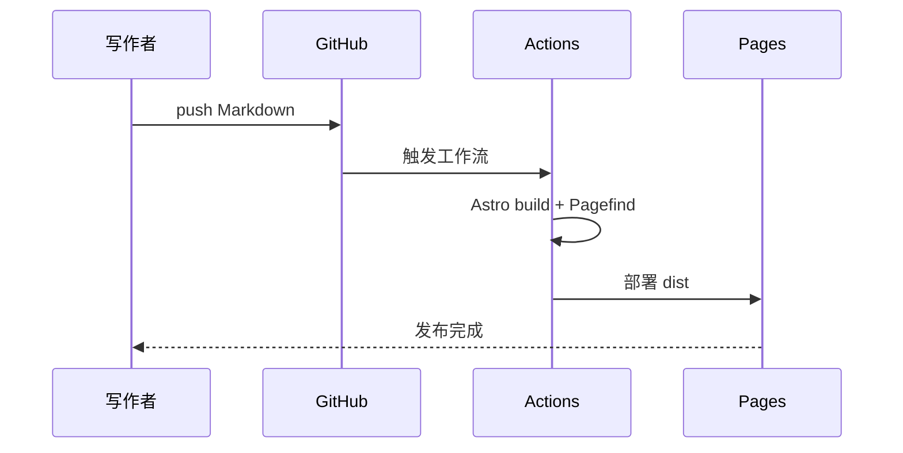

静态博客最重要的不是“零后端”，而是把内容生产和发布路径压缩到足够可靠：写一篇 Markdown，提交一次 Git，剩下的事由构建系统完成。

## 整体链路

下面这张图就是本站的发布过程。文章和页面都在仓库里，构建后只把纯静态文件部署到 GitHub Pages。

这条链路的好处是职责清晰：Astro 负责渲染与页面路由，Pagefind 负责在构建后生成本地搜索索引，GitHub Actions 负责重复执行构建和部署。

## 为什么选择 Astro

Astro 默认输出静态 HTML，Markdown 是它的一等内容格式。对博客来说，这意味着首屏轻、部署简单，也不需要为大多数页面加载完整的前端应用。

只有需要浏览器交互的地方才发送 JavaScript。例如本站的：

- Mermaid 图表渲染；
- 深浅色主题切换；
- 代码复制按钮；
- 本地全文搜索；
- Giscus 评论嵌入。

## 图表也保留在 Markdown 里

图表源码和文字一同参与版本控制。比起把流程图导出成不透明图片，这种方式更便于修改，也更适合技术文章。

## 需要先确定的两个配置

发布前务必在 `src/config.ts` 中填写真实的 GitHub Pages 地址；如果使用项目仓库页面，还要设置 `base` 为仓库名路径。评论功能则需要先在 GitHub 仓库启用 Discussions，再把 Giscus 提供的 ID 填入同一个配置文件。

其余工作都应该只是写作。
