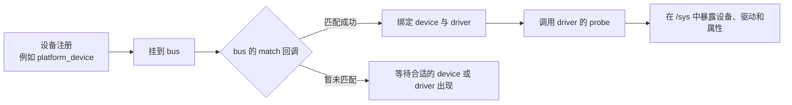
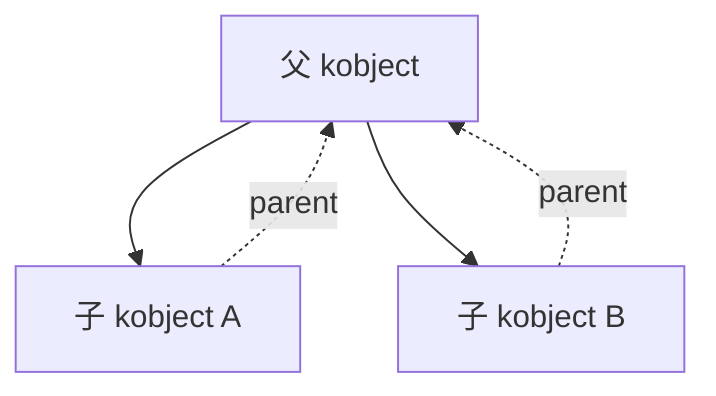
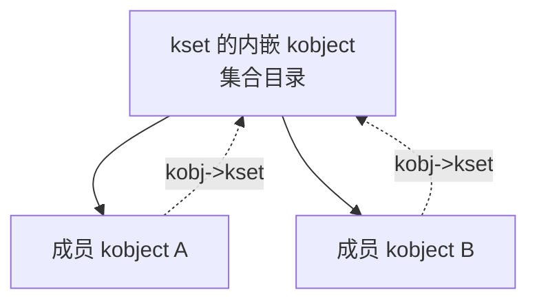

## 1. Linux 设备模型解决什么问题？

一块硬件被内核识别后，内核需要回答几个问题：

- 它是什么设备，挂在哪条总线上？
- 哪个驱动可以管理它？
- 驱动何时绑定、何时解绑？
- 用户空间怎样查看它的属性和状态？
- 设备被移除后，什么时候才能真正释放内存？

Linux 设备模型（Linux Device Model，LDM）就是处理这组问题的共同机制。它让内核中的设备、驱动和总线使用统一的关系与生命周期规则，并把大量信息导出到 sysfs（通常挂载在 `/sys`）。

一句话概括：**设备模型让设备能找到驱动，让内核能管理对象生命周期，也让用户空间能通过 `/sys` 观察设备关系。**

## 2. 先建立一张全局地图

先理解设备与驱动是怎样相遇的：



这张图里的四个对象最重要：

| 对象 | 它回答的问题 | 常见例子 |
| --- | --- | --- |
| `struct device` | “内核正在管理哪个设备？” | `platform_device`、`i2c_client`、PCI 设备 |
| `struct device_driver` | “哪段驱动代码可以处理设备？” | `platform_driver`、`i2c_driver` |
| `struct bus_type` | “设备和驱动在哪里匹配？” | platform、I2C、PCI、USB |
| `struct class` | “用户空间按什么功能查找设备？” | `/sys/class/block`、`/sys/class/net` |

普通驱动开发的大多数工作围绕这些对象进行。后文的 `kobject`、`kobj_type`、`kset` 和 `kref` 是它们能够被组织、引用计数并显示到 `/sys` 中的基础设施。

### 2.1 先在机器上观察

把概念和 sysfs 对照起来，理解会快得多。以 platform 总线为例：

```bash
# 查看已经注册的平台设备
ls /sys/bus/platform/devices

# 查看某个设备绑定的驱动（将 <设备名> 替换为真实名称）
readlink /sys/bus/platform/devices/<设备名>/driver

# 查看设备向用户空间暴露的基础事件信息
cat /sys/bus/platform/devices/<设备名>/uevent
```

其中，设备目录体现 `device`；`driver` 软链接体现设备与驱动的绑定关系；`uevent` 是内核通知用户空间的入口之一。

## 3. 设备模型底层的四块积木

理解了设备、驱动和总线后，再看底层对象管理机制会自然得多：

1. **kobject**：提供名字、层级、sysfs 注册和引用计数等公共能力。
2. **kobj_type**：描述一个包含 kobject 的对象具有什么 sysfs 行为、如何最终释放。
3. **kset**：把一组有关联的 kobject 组织成集合，并参与 uevent 处理。
4. **kref**：通用引用计数工具；kobject 使用它，但它并不只服务于设备模型。

可以这样记忆：

> kobject 是节点，kobj_type 是节点的行为说明书，kset 是节点集合，kref 是生命计数器。

下面继续展开这四块积木，先看它们怎样支撑“总线-设备-驱动”三层关系：

```text
bus_type  →  在 /sys/bus/××
device    →  在 /sys/devices/××
driver    →  在 /sys/bus/××/drivers/××
```

它们各自内嵌 kobject，挂到对应 kset，于是：

- 内核：通过 parent/child 指针形成一棵对象树，统一引用计数。
- 用户：在 /sys 里看到同样一棵目录树，读写文件即可获取/设置属性、触发 uevent。

总结：
kobject 是“节点”，ktype 是“节点类型”，kref 是“生命锁”，kset 是“同类集合”。四块积木搭起整个 Linux 设备模型。

### 基本构成——kobject（基石）

先看代码：

```c
// linux/kobject.h
struct kobject {
	const char             *name;        // 在 sysfs 中的目录/文件名
    struct list_head       entry;        // 挂到 kset 的链表节点
    struct kobject         *parent;      // 指向父 kobject，形成 /sys 层次
    struct kset            *kset;        // 所属集合（可为 NULL）
    const struct kobj_type *ktype;       // 类型描述（属性 + release）
    struct kernfs_node     *sd;          // sysfs 内部目录项（内部实现细节）
    struct kref            kref;         // 引用计数器

	unsigned int state_initialized:1;       /* 1 = kobject_init() 已完成 */
	unsigned int state_in_sysfs:1;          /* 1 = 已成功挂到 sysfs 目录树 */
	unsigned int state_add_uevent_sent:1;   /* 1 = KOBJ_ADD uevent 已发出 */
	unsigned int state_remove_uevent_sent:1;/* 1 = KOBJ_REMOVE uevent 已发出 */
	unsigned int uevent_suppress:1;         /* 1 = 暂时屏蔽所有 uevent */

#ifdef CONFIG_DEBUG_KOBJECT_RELEASE
	struct delayed_work release;
#endif
};
```

从代码里可以看到，kobject 就像它的名字一样，是一个“内核对象”。它不是某个具体硬件设备，而是内核抽出来的一套通用对象能力：给对象起名字、建立父子关系、挂到 sysfs、管理引用计数。**它让各种内核对象能够用相近的方式被管理。**

可以看到，kobject 内嵌了 kref，并通过指针关联 kset 和 kobj_type。

可以说，kobject 是 Linux 设备模型里最原子、最“底层”的那块积木。它本身**不表示任何具体设备或驱动**，只提供“把内核对象组织成一棵树（通过父子关系）、挂到 sysfs、做引用计数”所需的最小公共机制。

kobject = “目录节点 + 引用计数 + 父子指针”。先把它想成下面这样的树即可：



写普通 platform、I2C、SPI 等驱动时，一般不需要自己手写 kobject；先知道 `struct device` 等上层对象会用到它即可。

### 基本构成——kobj_type（行为）

kobj_type，字面上可以理解成 kobject 的“类型和行为”。它描述**这一类对象在 sysfs 里应该长什么样、支持哪些文件、怎么读写、最后怎么释放**。

可以先把它理解成“kobject 的行为说明书”，不必急着把它和每一种具体硬件设备一一对应。

```c
// linux/kobject.h
struct kobj_type {
	void (*release)(struct kobject *kobj);          /* 临终遗言 */
	const struct sysfs_ops *sysfs_ops;              /* 读写回调 */
	const struct attribute_group **default_groups;  /* 默认属性文件组 */
	const struct kobj_ns_type_operations *(*child_ns_type)(const struct kobject *kobj);
	const void *(*namespace)(const struct kobject *kobj);
	void (*get_ownership)(const struct kobject *kobj, kuid_t *uid, kgid_t *gid);
};
```

初学时重点看前三个；后面三个主要与命名空间和所有权有关，普通驱动里很少需要直接处理。

- `child_ns_type` 和 `namespace` 给网络/容器名字空间用；
- `get_ownership` 允许你动态指定 sysfs 文件的 uid/gid（默认 0/0）。除非你在写 netdevice 或者用户命名空间相关子系统，否则不用碰。

1. `release`

   当 kobject 引用计数降到 0 时，内核自动调用 `ktype->release(kobj);`。

   注意：**release 负责释放的是“包含 kobject 的那块上层结构”，而不是 kobject 本身。**

2. `sysfs_ops`

   提供 show/store 两个钩子，对应读/写：

   ```c
   static struct sysfs_ops foo_sysfs_ops = {
	   .show = foo_show,
	   .store = foo_store,
   };
   ```

   - show 原型：`ssize_t (*show)(struct kobject *, struct attribute *, char *);`，把 attr 对应的内部状态打印到 buf，返回长度。
   - store 原型：`ssize_t (*store)(struct kobject *, struct attribute *, const char *, size_t);`，把用户写入的 buf 解析后更新硬件/软件状态。

   内核已经准备好 `sysfs_{create,remove}_file()` 等 API。如果想在运行时动态增减属性，随时调用即可，不必改 kobj_type。

3. `default_groups`

   它长得不一样，是个二级指针。可以先把它理解成“指向 attribute_group 指针数组的指针”。先来看看 attribute_group 结构体里都有啥：

   ```c
   /* 一个组，可以包含普通属性、二进制属性、自己的可见性钩子 */
   struct attribute_group {
	   const char *name;  /* 可选：子目录名，NULL = 放本级目录 */
	   umode_t (*is_visible)(struct kobject *, struct attribute *, int);
	   umode_t (*is_bin_visible)(struct kobject *, struct bin_attribute *, int);
	   struct attribute **attrs;
	   struct bin_attribute **bin_attrs;
   };

   /* default_groups 就是指向这类 group 的指针数组 */
   const struct attribute_group **default_groups;  /* 最后一项必须是 NULL */
   ```

   每个 `attribute_group` 里可以放：

   - 普通属性数组 `attrs`；
   - 二进制属性数组 `bin_attrs`；
   - 自己的 `is_visible()`/`is_bin_visible()` 钩子，用来在运行时决定“某个文件该不该出现”。

   好处是把“一堆属性”打包，一次注册/卸载；还能按条件隐藏，省得再手动 `sysfs_create/remove` 来回折腾。照例以 NULL 结尾，例子：

   ```c
   static const struct attribute_group foo_config_group = {
	   .name  = "config",   /* 将创建 /sys/.../foo/config/ */
	   .attrs = config_attrs,
   };

   static const struct attribute_group foo_stats_group = {
	   .name  = "stats",    /* 将创建 /sys/.../foo/stats/ */
	   .attrs = stats_attrs,
   };

   static const struct attribute_group *foo_groups[] = {
	   &foo_config_group,
	   &foo_stats_group,
	   NULL,
   };
   ```

总结：

kobj_type 就是 **“kobject 的用户手册 2.0”**——`release` 告诉你最后怎么释放，`sysfs_ops` 告诉你怎么读写，`default_groups` 告诉你目录里该摆哪些文件（还能按条件隐藏）。其余几个字段和命名空间有关，初学阶段知道它们存在就够了。

### 基本构成——kset（集合）

kset 就是“把一堆 kobject 归到同一个‘抽屉’里，并给它们提供公共 hotplug 事件入口”的容器。它自己**也内嵌了一个 kobject**，所以既能当“目录”又能当“链表头”，在 /sys 里也可能表现为一个真实目录。

一句话：kset = kobject 链表 + 共用 uevent 操作 + 自带目录。

```c
struct kset {
	struct list_head list;        /* 把所有成员 kobject 串在一起 */
	spinlock_t list_lock;         /* 保护链表并发 */
	struct kobject kobj;          /* 我自己也是一个目录节点 */
	const struct kset_uevent_ops *uevent_ops; /* 热插拔事件过滤器 */
};
```

kset 的内嵌 kobject 同样要走 `kobject_add()`，因此：

- 若成员 kobject 没有显式 parent，通常会以所属 kset 的内嵌 kobject 作为父对象；
- 手动指定 parent 时，目录层级会随之变化。

常见例子：

```text
devices_kset → /sys/devices/
block_kset   → /sys/block/
module_kset  → /sys/module/
```

Linux 中有内置的 kset，如：

```c
devices_kset      /* /sys/devices/   所有物理设备的根 */
bus_kset          /* /sys/bus/       总线类型 */
class_kset        /* /sys/class/     按功能分类 */
module_kset       /* /sys/module/    已加载模块 */
platform_bus_type /* /sys/bus/platform/ 平台总线 */
```

驱动代码很少自己再建 kset，多数情况下**把设备挂到已有 kset** 就行。

#### 和 kobject 的父子关系

1. 每个 kobject 可以同时属于**一个 kset**（通过 `kobj->kset` 指针）和**一个 parent kobject**（`kobj->parent`）。
2. 加入 kset 的时机：在 `kobject_init_and_add()` 或 `kobject_add()` 之前把 `kobj->kset` 赋好即可。内核会把该 kobj 挂到 `kset->list`，并在 parent 为空时把 `kobj->parent` 设为 `&kset->kobj`。

若没有显式 parent，目录层次通常可以理解成：`/sys/.../kset目录/成员目录/`。



**重点：**

1. **kset 本身也是一个目录（因为它内嵌 kobject）。**
2. **同属一个 kset 的所有 kobject 被同一根链表串着，热插拔事件走同一套 `uevent_ops`。**
3. **设备模型里“大根目录”——`/sys/devices`、`/sys/bus`、`/sys/class`——都是 kset，它们把整张拓扑图串成一棵真正的树。**

### 基本构成——kref（计数器）

kref 可以理解成“最简寿命计数器”。kobject 用它解决“什么时候真正释放内存”这个问题；它本身也是内核里通用的引用计数工具。

```c
struct kref {
	refcount_t refcount;
};
```

初学先掌握 3 个核心 API：

```c
void kref_init(struct kref *kref)        /* 初始化为 1 */
void kref_get(struct kref *kref)         /* +1，返回 void */
int  kref_put(struct kref *kref, void (*release)(struct kref *kref))
```

`kref_put()` 是核心：

- 原子减 1 后如果结果 == 0，立即调用 `release(kref)` 并返回 1；
- 否则返回 0，表示对象仍活着。

典型用法（以 kobject 为例）：

1. 诞生：`kobject_init()` → `kref_init(&kobj->kref)`。初始引用 1，代表“创建者手里那份”。
2. 路过的人拿一份：`kobject_get(kobj)`，内部就是 `kref_get(&kobj->kref)`。
3. 用完交回：`kobject_put(kobj)`，内部 `if (kref_put(&kobj->kref, kobject_release))`。返回 1 表示已无外人，调用 `kobject_release()`，再调到 `ktype->release(kobj)`，最终释放上层结构。
